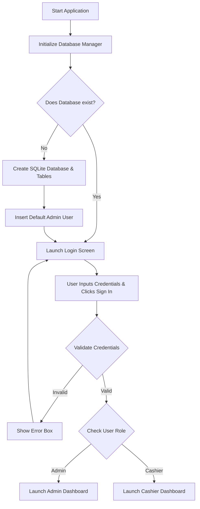

# 🛒 Saadi Groceries - Grocery Store Management System

A Python-based desktop application built using Tkinter, SQLite3, and custom design styles to manage grocery store transactions, generate sales reports, and handle user authentication with role-based access controls.

The project contains two versions:
1. **[Advanced Version](file:///E:/Python%20Projects/Grocery%20Store%20Management/Grocery%20Store%20Management%20System%20App.py)**: A database-backed application featuring user logins, admin controls, sales tracking, and user management.
2. **[Lightweight Version](file:///E:/Python%20Projects/Grocery%20Store%20Management/%23%20grocery_store_management.py)**: A simplified, database-less application that reads and writes sales data directly to a CSV file.

---

## 📊 Application Architecture & Workflows

To help you understand how the system is structured and how data flows through it, the diagrams below outline the main authentication workflow and system components.

### 1. User Authentication & Authorization Flow
When the application starts, it initializes the local SQLite database and determines user routing based on their login credentials and roles.



### 2. System Architecture & Component Interaction
The system separates UI components from database management using helper classes:

```mermaid
graph LR
    subgraph UI Layer (Tkinter / TTK)
        LoginScreen[LoginScreen]
        GroceryStoreApp[GroceryStoreApp]
        AddSale[Add Sale Dialog]
        ManageUsers[User Management Dialog]
    end

    subgraph Logic Controller
        AppController[Action Handlers]
    end

    subgraph Data Store (SQLite / CSV)
        DBManager[DatabaseManager]
        SQLite[(saadi_groceries.db)]
        CSV[CSV Reports / Sales Data]
    end

    LoginScreen --> AppController
    GroceryStoreApp --> AppController
    AddSale --> AppController
    ManageUsers --> AppController

    AppController --> DBManager
    DBManager --> SQLite
    AppController --> CSV
```

---

## ✨ Features

### 🔐 Advanced Version (`Grocery Store Management System App.py`)
* **Role-Based Access Control (RBAC):**
  * **Admin:** Access to Sales Dashboard, add/delete sales transactions, CSV report generation, and User Management dashboard.
  * **Cashier:** Access to Sales Dashboard, adding/deleting transactions, and exporting reports (User Management hidden).
* **Robust Authentication:** Sleek, modern login panel with input validation and forgot password handlers.
* **Database Persistence:** SQLite integration ensures instant data commits and queries.
* **Interactive Data Table:** Uses Tkinter `Treeview` with custom padding, row-heights, and vertical scrollbar integration.
* **User Management System:** Admins can register new users (roles: `admin`, `cashier`) and delete existing ones. Self-deletion protection is built-in.
* **Data Validation:** Prevents negative quantity, price, or empty entries.

### ⚡ Lightweight Version (`# grocery_store_management.py`)
* **Minimalist Approach:** No login screens, database configuration, or role setup required.
* **CSV Data Store:** Directly reads and writes transactions to `sales_data.csv` on the fly.
* **Default Fallbacks:** Automatically generates dummy transaction data if no local CSV database is detected.

---

## 🗄️ Database Schema Layout

The database `saadi_groceries.db` is built on SQLite and maintains two tables:

### 1. `sales` Table
Keeps record of all transactions completed at the grocery store.

| Column | Type | Constraints | Description |
| :--- | :--- | :--- | :--- |
| `id` | TEXT | PRIMARY KEY | Unique sale identifier |
| `item` | TEXT | - | Name of the grocery product |
| `quantity` | INTEGER | - | Quantity purchased |
| `price` | REAL | - | Unit price of the item |
| `total` | REAL | - | Total transaction cost (`quantity * price`) |
| `date` | TEXT | - | Date/time stamp of the transaction |

### 2. `users` Table
Handles credentials and user authorization levels.

| Column | Type | Constraints | Description |
| :--- | :--- | :--- | :--- |
| `email` | TEXT | PRIMARY KEY | User email address used for login |
| `password` | TEXT | - | Plain text password credential |
| `role` | TEXT | - | Authorization level: `admin` or `cashier` |

---

## 🛠️ Installation & Setup

### Prerequisites
* Python 3.x installed on your local computer.
* SQLite (bundled automatically with Python).
* Tkinter (usually comes pre-installed with Python standard library).

### Running the Application

1. Clone or navigate to the directory:
   ```bash
   cd "E:\Python Projects\Grocery Store Management"
   ```

2. Run the **Advanced Version** (Database & Roles):
   ```bash
   python "Grocery Store Management System App.py"
   ```

3. Run the **Lightweight Version** (Standalone CSV-based):
   ```bash
   python "# grocery_store_management.py"
   ```

> [!NOTE]
> **Default Admin Account:**
> On the first run of the Advanced Version, a default admin account is automatically created:
> * **Email:** `mohtarm@saadi.com`
> * **Password:** `admin123`

---

## 📂 Code Structure Overview

* **`DatabaseManager` class:** Integrates with sqlite3 API, handles connection lifetime, schema creation, validation logic, and inserts/deletes.
* **`LoginScreen` class:** Renders form controls, validates login inputs, handles styling variables, and redirects to Dashboard callback upon success.
* **`GroceryStoreApp` class:** The main shell of the application which loads dynamic UI screens, updates transaction tables, populates new inputs, deletes entries, and writes formatted reports.

---

## 📈 CSV Sales Reports
Both versions support exporting logs to standard spreadsheet formats:
* The advanced version generates logs dynamically named `saadi_sales_report_YYYYMMDD_HHMMSS.csv` inside your project directory.
* The lightweight version continuously reads and updates `sales_data.csv`.
